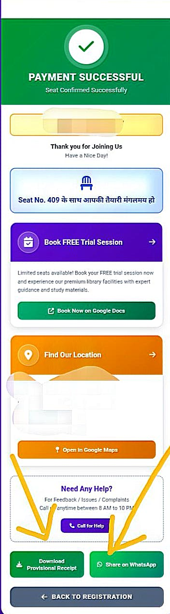

# Seat Booking and Payment Process

See Demo :- [My_life_project_click_and_how_it_work](https://web-aibot-autogeneratedreceiptmodal.vercel.app/)

Source code:- [Private Source code of template](https://github.com/MrAnujBabu/web-aibot-autogeneratedreceiptmodal)
## 📋 Process Steps

### Step 1: Filling the Registration Form and Payment
In this step, the following information is collected from the user and payment is made via UPI.

**Tasks to be performed:**
1.  **Personal Information:** Enter student name, mobile number, and secret pin.
2.  **Date and Shift Selection:** Choose start date, end date, month, and full day/half day shift.
3.  **Seat and Fee:** Seat number is allocated. Pay the due amount (₹258 in this example).
4.  **Payment:** Scan/tap the UPI ID or QR Code to make payment.
5.  **Upload Screenshot:** Upload payment screenshot for verification.
6.  **Send for Admin Approval:** Finally, click the "SEND TO ADMIN APPROVAL" button to send for approval.
### Step 3: Payment Confirmation and Seat Assurance
After successful payment and admin approval, this success page appears.

**Information and Options on this Page:**
1.  **Success Message:** "PAYMENT SUCCESSFUL" and "Seat Confirmed Successfully" messages are displayed.
2.  **Seat Details:** Confirmed seat number (409) is shown.
3.  **Additional Offer:** A link is provided to book a free trial session.
4.  **Contact and Location:**
    *   **Find Location:** Link to open library location in Google Maps.
    *   **Help & Support:** Contact details for feedback/issues/complaints (8 AM to 10 PM).
    *   **WhatsApp:** Option to contact directly on WhatsApp.
5.  **Return Link:** Click the "BACK TO REGISTRATION" button to return to the main registration page.

### Step 3: Receiving Provisional Receipt
While waiting for admin approval, a provisional receipt is generated. This receipt is a temporary confirmation of payment and registration.

[View Provisional Receipt PDF](images/Demon_Provisional_Receipt_copy.pdf)

**Key Information Included in Receipt:**
*   **Receipt Number:** RR-20260112-0802
*   **Student Details:** Name (Demon), Mobile Number, Address
*   **Membership Period:** 12/01/2026 to 11/02/2026 (January Month)
*   **Shift:** Full Day
*   **Financial Summary:**
    *   Total Amount: ₹133.00
    *   Paid Amount: ₹123 (via Cash)
    *   Due Amount: ₹10
*   **Current Status:** Pending (Awaiting Administrative Approval)

**Important Notes:**
*   Seat number is currently "Unassigned" and will be allocated later.
*   This receipt is provisional and subject to admin approval.
*   It is mandatory to carry this receipt and ID proof during library visits until confirmation.

